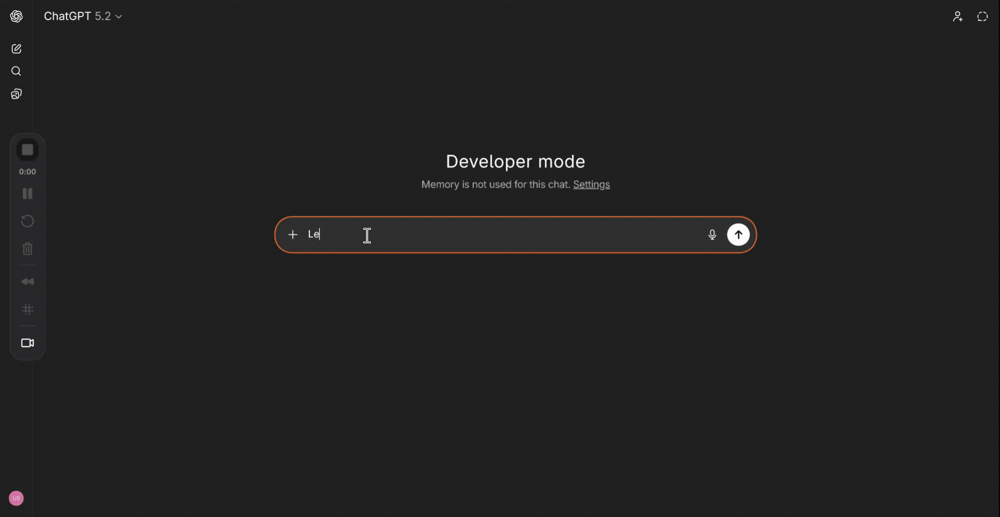

# Flappy Bird MCP App

A fully playable Flappy Bird game that runs inline in AI chat clients via MCP Apps.



## Setup

```bash
bun install
bun run build
```

## Run

```bash
bun run serve
```

Server starts at `http://localhost:3001/mcp`.

### Expose via tunnel (for remote hosts like ChatGPT, Claude.ai)

```bash
cloudflared tunnel --url http://localhost:3001
```

Use the generated `https://*.trycloudflare.com/mcp` URL as your MCP server endpoint.


## Configure

### VS Code (1.109+)

See the [VS Code MCP docs](https://code.visualstudio.com/docs/copilot/customization/mcp-servers) to add an HTTP server with URL `http://localhost:3001/mcp`.

### ChatGPT

1. Start the tunnel (see above)
2. Go to [chatgpt.com](https://chatgpt.com) → Settings → Apps & Connectors → Add new connector
3. Enter a name (e.g. "Flappy Bird") and paste the tunnel URL: `https://<your-tunnel>.trycloudflare.com/mcp`
4. In a new chat, click **+** → **More** → select the connector

### Claude.ai

1. Start the tunnel (see above)
2. Go to [claude.ai](https://claude.ai) → Settings → Integrations → Add MCP Server
3. Paste the tunnel URL: `https://<your-tunnel>.trycloudflare.com/mcp`

## Tools

| Tool | Description |
|------|-------------|
| `play-flappy-bird` | Launches the game (renders inline) |
| `submit-score` | Submits a score from the game UI |
| `get-high-score` | Returns the session high score |
